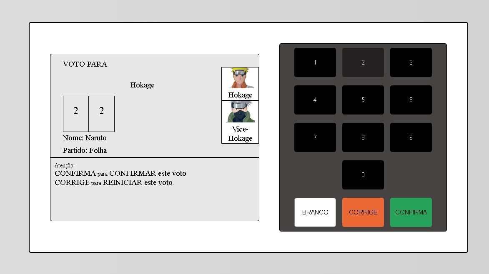
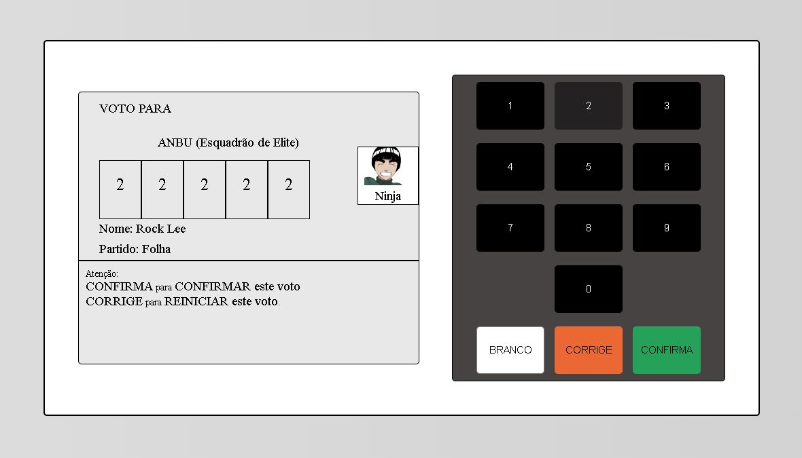

# Urna Eletrônica Naruto

Naruto nas Eleições!

Para quem gosta do Anime Naruto e Tecnologia, eu construí uma urna eletrônica online para à eleição do Hokage de Konoha e o esquadrão de elite ANBU!

## Topics

O projeto tem por objetivo aprimorar as minhas habilidades de back-end com NodeJS através da utilização do padrão REST para chamadas de API. Além disso, temos o Client recebendo os dados do servidor no formato JSON e compilando os dados para à interface dos usuários ninjas da folha.

## Technologies

  
  
    
  

## Test

Para testar o projeto: <a href="https://gustavoestevesr.github.io/Urna-Eletronica-Naruto/">Acesse aqui!<a>

## Rules

- Rock Lee - 22222 
- Hinata Hyuga - 33333

- Naruto Uzumaki e Kakashi Sensei - 22
- Sasuke Uchiha e Kakashi Sensei - 33
- Sakura Haruno e Hinata Hyuga - 44

## Screenshots

 

